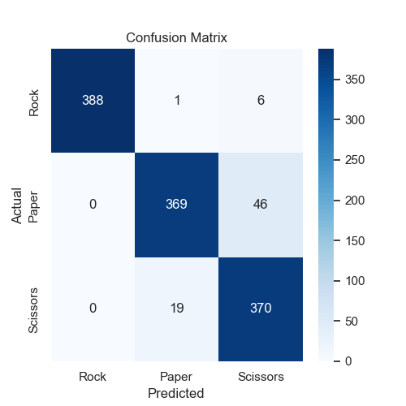
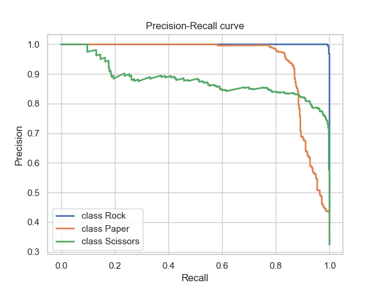

# RPS Classifier: Image Classification for Rock, Paper, Scissors 

## Introduction

The RPS Classifier represents a cutting-edge application of deep learning technology in the domain of image classification. Specifically designed to categorize hand gestures into Rock, Paper, or Scissors, this model showcases the power of Convolutional Neural Networks (CNNs) in solving complex visual recognition tasks.

## Technical Specifications

- Framework: Implemented in PyTorch, leveraging its robust ecosystem for deep learning

- Architecture: Custom CNN optimized for RPS gesture recognition
Performance: Achieves high accuracy across diverse datasets

- Benchmarking: Rigorously compared against industry-standard models including ResNet, VGG, AlexNet, GoogLeNet, and SqueezeNet

- Visualization: Comprehensive suite of performance metrics and analytical visualizations

- User Interface: Intuitive GUI for seamless interaction and real-time classification

## Model Architecture

The RPS Classifier's neural network architecture is meticulously designed for optimal performance:

- **Convolutional Layers**: Multiple layers for hierarchical feature extraction

- **Activation Functions**: ReLU (Rectified Linear Unit) for introducing non-linearity

- **Pooling Operation**s: Max-pooling for spatial dimensionality reduction

- **Fully Connected Layers**: Final layers for mapping extracted features to class probabilities

## Performance Evaluation

Our rigorous evaluation protocol includes:

- **Accuracy and Loss Tracking**: Comprehensive monitoring of model performance during training and testing phases

- **Data Distribution Analysis**: In-depth examination of sample representation in both training and testing datasets

- **Comparative Analysis**: Side-by-side performance benchmarking against top-tier image classification models

## Visualizations

### RPS Classifier 

- **Accuracy and Loss**: 


<br><br>

- **Confusion Matrix**: 

<div style="display: flex;">
  
  
</div>

## Model Comparison

The RPS Classifier's performance is compared with other popular models, including AlexNet, GoogleNet and Squeeze, using metrics such as accuracy and loss. Confusion Matrix and Precision-Recall Curves follow:

## Confusion Matrix and Precision-Recall Curves
<br>

- **AlexNet** benchmarking: 

<div style="display: flex;">
  
  
</div>
<br><br>

- **GoogLeNet** benchmarking: 

<div style="display: flex;">
  
  
</div>
<br><br>

- **SqueezeNet** benchmarking:
<div style="display: flex;">
  
  
</div>

<br><br>

## Graphical User Interface

The RPS Classifier features a sophisticated yet user-friendly interface:


- **Data Input Mechanism**: Streamlined system for loading image data

- **Ground Truth Visualization**: Clear display of input data labels

- **Real-time Classification Output**: Instant presentation of model predictions

- **Intuitive Control System**: Efficiently designed buttons for seamless navigation and operation

## Installation and Usage

**System Requirements** :

- Python 3.7 or higher

- MPS-compatible GPU (recommended for optimal performance)

- ### Repository Cloning

```bash
git clone git@github.com:nameisalfio/RPS_Classifier.git
cd RPS_Classifier
```

- ### Environments Setup

```bash
pip install -r requirements.txt
```

## GUI Execution

```bash
python3 gui.py
```

## Project Structure

```bash
RPS_Classifier
├── __pycache__
├── data
│   ├── test
│   │   ├── paper_frames
│   │   ├── rock_frames
│   │   ├── scissors_frames
│   │   └── video_mp4
│   └── train
│       ├── paper_frames
│       ├── rock_frames
│       ├── scissors4_frames
│       ├── scissors5_frames
│       ├── scissors6_frames
│       ├── scissors_frames
│       ├── video_MOV
│       └── video_MP4
├── icons
├── logs
│   ├── alexnet_experiment
│   ├── experiment_1
│   ├── experiment_2
│   ├── experiment_3
│   ├── experiment_4
│   ├── experiment_5
│   ├── experiment_6
│   ├── experiment_7
│   ├── googlenet_experiment
│   └── squeezenet_experiment
├── metrics
├── models
└── plots

32 directories
```

## Contributing

We welcome contributions from the community. Please refer to our Contributing Guidelines for detailed information on how to participate in the project's development.