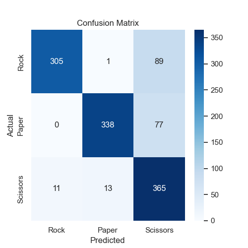
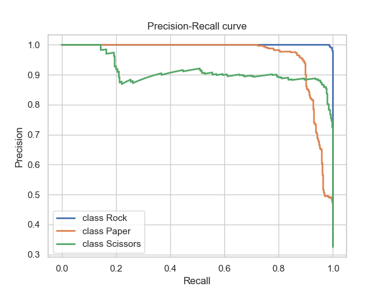
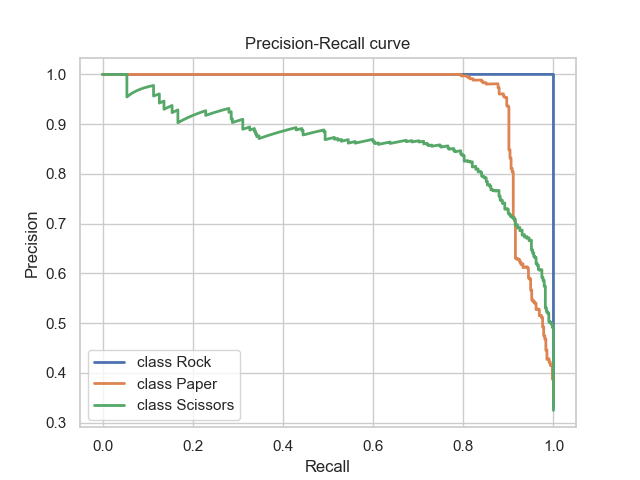

# RPS Classifier

The RPS Classifier is a deep learning model designed for the classification of images into the categories of Rock, Paper, and Scissors (RPS). Leveraging Convolutional Neural Networks (CNNs), this model provides an accurate and efficient solution for RPS image classification tasks.

## Model Overview

The RPS Classifier is implemented in PyTorch, a popular deep learning framework, and comprises a CNN architecture tailored for image classification tasks. The model architecture is structured as follows:

- **Convolutional Layers**: The model consists of multiple convolutional layers, each followed by a rectified linear unit (ReLU) activation function and max-pooling operation. These layers extract meaningful features from input images.
  
- **Linear Layers**: The final layers of the model are fully connected linear layers responsible for mapping the extracted features to class labels. 

## Performance Evaluation

The performance of the RPS Classifier can be assessed using various metrics and visualizations, including:

- **Accuracy and Loss**: Visualizations depicting the training and testing accuracy and loss trends over epochs.
- **Distribution of Samples**: Histograms illustrating the distribution of samples in both the training and testing datasets.
- **Model Comparison**: Comparative analysis of the RPS Classifier against other models, such as ResNet and VGG, showcasing performance metrics like accuracy and loss.

## Visualizations

### RPS Classifier 

- **Accuracy and Loss**: 

- **Confusion Matrix**: <br>


### Model Comparison

The RPS Classifier's performance is compared with other popular models, including ResNet and VGG, using metrics such as accuracy and loss.

#### Precision-Recall Curves

- **AlexNet**: 
- **GoogLeNet**: 
- **SqueezeNet**: 

## User Interface

The RPS Classifier provides a user-friendly interface for easy interaction. The interface includes features such as:

- **Input from File**: Users can load input data (e.g., images) from files.
- **Ground Truth Display**: An area to display the ground truth label of the input data.
- **Result Display**: An area to display the classification result obtained by the RPS Classifier.
- **Interactive Controls**: Simple controls (e.g., buttons) for intuitive interaction with the interface.

## Cloning the Repository

You can clone this repository using the following command:

```bash
git clone git@github.com:nameisalfio/RPS_Classifier.git
```

## Requirements

To run the RPS Classifier, you need to install the following Python libraries:

```bash
pip install -r requirements.txt
```

## Directory Structure

The directory structure of the project is as follows:

```bash
RPS_Classifier
├── data
│   ├── test
│   │   ├── paper_frames
│   │   ├── rock_frames
│   │   ├── scissors_frames
│   │   └── video_mp4
│   └── train
│       ├── paper_frames
│       ├── rock_frames
│       ├── scissors_frames
│       ├── video_MOV
│       └── video_MP4
├── icons
├── logs
│   ├── alexnet_experiment
│   ├── experiment_1
│   ├── experiment_2
│   ├── experiment_3
│   ├── experiment_4
│   ├── experiment_5
│   ├── experiment_6
│   ├── experiment_7
│   ├── googlenet_experiment
│   └── squeezenet_experiment
├── metrics
├── models
└── plots
```

## Usage

For using user interface you can run the following command :

```bash
python3 gui.py
```